# 🌐 Website Scraper Chrome Extension

 <!-- Placeholder for banner image -->

Welcome to the **Website Scraper**, a powerful Chrome extension that scrapes, summarizes, translates, and visualizes website content with a stunning, neon-inspired UI! 🚀 Built with a Flask backend and advanced AI agents, this tool transforms web data into actionable insights with interactive charts and flowcharts. Whether you're a researcher, developer, or curious explorer, this app makes web analysis a breeze. ✨

## 🎉 Features

- **Content Scraping** 📄: Extracts text and HTML from any webpage with a single click.
- **Internal Link Discovery** 🔗: Finds and lists up to 10 internal links, building a comprehensive content map.
- **AI-Powered Summarization** 🧠: Generates concise 150-word summaries using Grok's language model.
- **Multilingual Translation** 🌍: Translates summaries into English, Spanish, French, German, or Hindi.
- **Dynamic Visualizations** 📊:
  - **Chart.js Bar Charts**: Displays top 10 word frequencies with vibrant neon colors.
  - **Mermaid Flowcharts**: Visualizes website structure with interactive, emoji-enhanced diagrams.
- **Stunning UI** 🎨: Features a dark theme with neon gradients, glassmorphism, and smooth animations for loading and content display.
- **Secure Backend** 🔒: Deployed on Render with HTTPS and CORS for reliable, secure communication.
- **Real-Time Feedback** 🔔: Shows processing status and errors via a sleek status bar.

## 🛠️ Tech Stack

- **Frontend**:
  - Chrome Extension (HTML, JavaScript, CSS)
  - Chart.js (v4.4.1) for word frequency charts
  - Mermaid.js (v10.9.1) for website structure flowcharts
  - Poppins font for modern typography
- **Backend**:
  - Flask (Python) with Gunicorn for production
  - SQLite for data storage
  - LangChain and Grok API for summarization and translation
  - NLTK for word tokenization
  - BeautifulSoup for link scraping
  - Flask-SocketIO for real-time updates
- **Deployment**:
  - Render (Docker-based) with free HTTPS
- **Dependencies**:
  - See `backend/requirements.txt` for Python packages

## 📈 Workflow

The following Mermaid flowchart illustrates how the Website Scraper processes a webpage from user input to visualized output:

```mermaid
flowchart TD
    A["1️⃣ User Opens the Extension"] --> B["2️⃣ Clicks 'Scrape Website'"]
    B --> C["3️⃣ Chooses Language"]
    C --> D["4️⃣ Clicks 'Process Content'"]
    D --> E["5️⃣ Webpage Content is Collected"]
    E --> F["6️⃣ Content Sent to Server"]
    F --> G["7️⃣ Server Extracts Links"]
    G --> H["8️⃣ Creates a Simple Summary"]
    H --> I["9️⃣ Translates Summary"]
    I --> J["🔟 Sends Back the Results"]
    J --> K["✅ User Sees Links, Summary & Translation"]

    style A fill:#00b894,stroke:#000,stroke-width:1.5px
    style D fill:#0984e3,stroke:#000,stroke-width:1.5px
    style F fill:#8b5cf6,stroke:#000,stroke-width:1.5px
    style J fill:#06b6d4,stroke:#000,stroke-width:1.5px
    style K fill:#34d399,stroke:#000,stroke-width:1.5px
```



## 🚀 Getting Started

### Prerequisites

- **Google Chrome** (latest version)
- **Python 3.10+** (for local backend development)
- **Git** (for cloning the repository)
- **Docker** (for deployment, optional)
- **Groq API Key** (sign up at [Groq](https://console.groq.com/keys) for free access)

### Local Setup

1. **Clone the Repository**:
   ```bash
   git clone https://github.com/arav7781/website-scraper.git
   cd website-scraper
   ```

2. **Set Up the Backend**:
   ```bash
   cd backend
   python -m venv venv
   source venv/bin/activate  # On Windows: .\venv\Scripts\activate
   pip install -r requirements.txt
   export GROQ_API_KEY=your-groq-api-key  # On Windows: set GROQ_API_KEY=your-groq-api-key
   mkdir -p images/plotly_figures/pickle
   python app.py
   ```
   - Backend runs at `http://localhost:5000`.

3. **Set Up the Chrome Extension**:
   - Navigate to `chrome://extensions/` in Chrome.
   - Enable **Developer mode**.
   - Click **Load unpacked** and select the `extension/` folder.
   - Ensure files include:
     - `popup.html`
     - `popup.js`
     - `styles.css`
     - `manifest.json`
     - `content.js`
     - `background.js`
     - `icon.png` (128x128)

4. **Test the Extension**:
   - Open a webpage (e.g., `https://example.com`).
   - Click the extension icon.
   - Toggle **Scrape Website**, select a language and visualization type, and click **Process Content**.
   - Watch the neon loading animation and enjoy the fade-in results! 🎉

### Deployment

To make the extension publicly accessible, deploy the backend to Render:

1. **Push Backend to GitHub**:
   ```bash
   cd backend
   git init
   git add .
   git commit -m "Initial backend commit"
   git remote add origin https://github.com/your-username/website-scraper-backend.git
   git branch -M main
   git push -u origin main
   ```

2. **Deploy on Render**:
   - Sign up at [render.com](https://render.com) and link your GitHub account.
   - Create a **Web Service**, select your backend repository.
   - Configure:
     - **Runtime**: Docker
     - **Region**: Closest to your users
     - **Instance Type**: Free (upgrade for production)
     - **Environment Variables**:
       - `GROQ_API_KEY`: Your Groq API key
       - `FLASK_ENV`: `production`
   - Deploy and note the URL (e.g., `https://website-scraper-backend.onrender.com`).

3. **Update Extension**:
   - Edit `extension/popup.js` to replace `http://localhost:5000` with your Render URL.
   - Update `extension/manifest.json` permissions to include your Render URL.
   - Reload the extension in Chrome.

4. **Publish to Chrome Web Store**:
   - Create a ZIP of the `extension/` folder:
     ```bash
     cd extension
     zip -r ../website-scraper-extension.zip .
     ```
   - Visit [Chrome Web Store Developer Dashboard](https://chrome.google.com/webstore/devconsole).
   - Pay the $5 fee, upload the ZIP, and submit for review.

## 🖼️ Screenshots

<!-- Add real screenshots for better appeal -->


## 🛠️ Troubleshooting

- **Button Not Clickable**:
  - Ensure the **Scrape Website** toggle is checked.
  - Check Console (F12) for errors.
- **CORS Errors**:
  - Verify backend CORS allows your extension’s origin.
  - Update `app.py` CORS settings if needed.
- **Backend Not Responding**:
  - Check Render logs for errors.
  - Ensure `GROQ_API_KEY` is set correctly.
- **Visualizations Fail**:
  - Confirm Chart.js/Mermaid scripts load (Network tab).
  - Check backend response for `word_freq_data` or `mermaid_code`.

## 🤝 Contributing

We welcome contributions! 🙌 Follow these steps:

1. Fork the repository.
2. Create a feature branch (`git checkout -b feature/amazing-feature`).
3. Commit changes (`git commit -m "Add amazing feature"`).
4. Push to the branch (`git push origin feature/amazing-feature`).
5. Open a Pull Request.

## 📜 License

This project is licensed under the MIT License. See [LICENSE](LICENSE) for details.

## 🌟 Acknowledgments

- [groq](https://console.groq.com/keys) for the Groq API
- [Chart.js](https://www.chartjs.org) and [Mermaid.js](https://mermaid.js.org) for visualizations
- [Render](https://render.com) for seamless deployment
- [Poppins Font](https://fonts.google.com/specimen/Poppins) for stunning typography

---

Built with ❤️ by Arav Saxena. Star the repo ⭐ if you love it!
